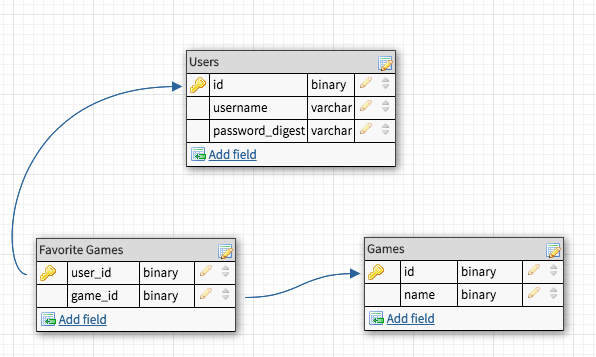
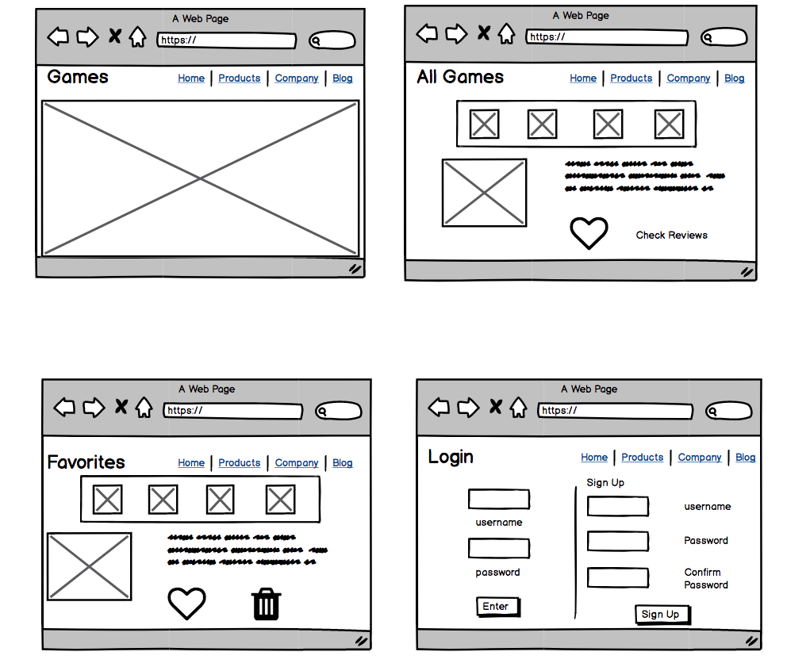

# Project-4

# Project Description

### MVP :

For my project 4, I will be creating a video game information app using the free Giant Bomb api. My app will have a page that displays all of the games and users will be able to click on a game so they can learn more. Users will also be able to sign in, add games to their favorites, and add reviews on the game.

### POST MVP :

I will have a forums page where signed in users will be able to ask questions, create threads and respond to others. Users will be able to filter their results by genre, year, rating, name among other criteria.

### Technologies Used

For this project, I am using React, Ruby on Rails and Bootstrap. The API i found was from https://www.giantbomb.com/api/documentation#toc-0-17 and it includes all the information I need for this project.

### User Stories

-As a Privacy minded individual I want to be able to sign in to my account so I can leave reviews, notes and add games to my favorites page.

-As a user I want to see all the games so that I can scroll through and look at the game information I may want to see.

-As a user I want to see a specific game so that I can learn more in depth about it before i decide if i want to buy it or not.

-As a opinionated person I want to be able to write a review on a game so that I can tell others what I think about the game.

*   As a detail oriented individual I want to see all the information of the game so that I can have all the knowledge possible and rule the world.

*   As an impatient user I want to have minimal loading time because I am very impatient.

-As a user I want to be able to filter my results so that I can only look at the games I want to see.

-As a helpful individual Id like to give a rating to a game so that people will know if its good or not.

-As a user I want to be able to delete a game off my favorites so that I can maintain my favorites list.

*   As a user I would like to search for a specific game/ character by year, rating and genre so that I can be more specific about my searches.

### Database Structure

### Wireframes

